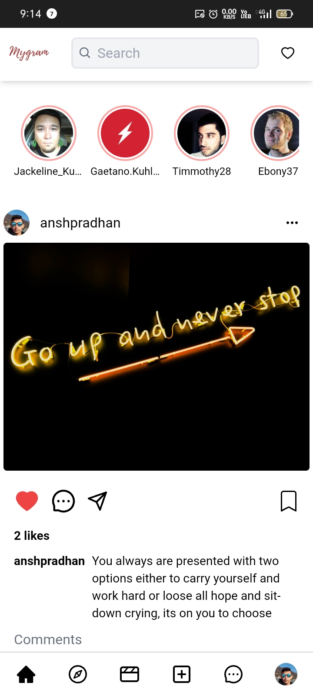
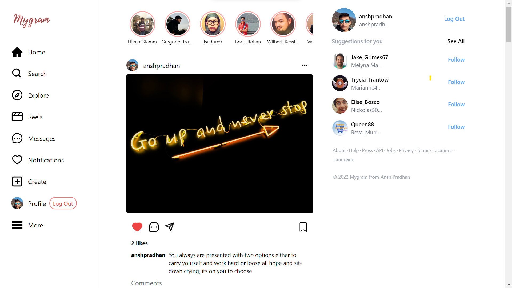

<h1 align="center">MyGram Instagram Clone</h1>

  

Welcome to the MyGram Instagram Clone repository! This project is a social media platform that mimics the functionalities of Instagram. It allows users to sign in with their Google accounts, upload posts, like and comment on other users' posts, and interact with other users.

|  <h2>Mobile View</h2> |  <h2>Desktop View</h2> |
| --- | --- |
| || 

## Technologies Used

This project was built using various technologies, including:
- Next.js
- Firebase
- Tailwind CSS
- Recoil
- NEXT AUTH

Next.js is a React-based framework that provides server-side rendering and other performance optimizations. Firebase is used for data storage and authentication, while Tailwind CSS provides a modern and responsive layout. Recoil is used for state management, and NEXT AUTH provides secure user authentication and authorization.

## Usage

To use the MyGram Instagram Clone, simply navigate to the website and sign in with your Google account. Once logged in, you can upload posts, like and comment on other users' posts, and interact with other users.

The website is completely responsive and looks great on both desktop and mobile devices, providing a seamless user experience across all devices.

## Installation

To install and run the project locally, follow these steps:
1. Clone the repository to your local machine
2. Install the necessary dependencies using `npm install`
3. Start the development server using `npm run dev`
4. Navigate to `localhost:3000` in your web browser to view the website

## Contributing

If you would like to contribute to this project, feel free to submit a pull request or create an issue. Contributions are always welcome!

Thank you for visiting the MyGram Instagram Clone repository. We hope you enjoy using our platform!
